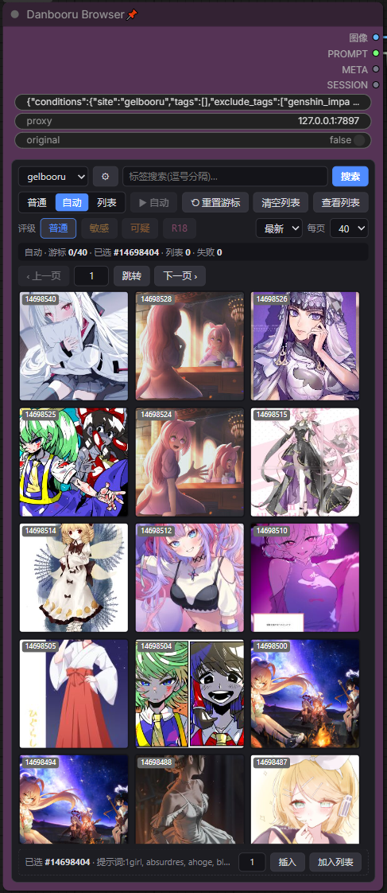

# Danbooru Browser

ComfyUI 自定义节点:在画布上像浏览网站一样翻看 danbooru / gelbooru / civitai 的图,把选中的图连同提示词接进生成流程。



## 节点

| 节点 | 说明 |
| --- | --- |
| **Danbooru Browser** | 主浏览节点:三站浏览、搜索、筛选、翻页、普通/自动/列表三种输出模式 |
| **文本(透传)** | 提示词编辑:原文/标签双模式、中文翻译(本地索引 + 云翻译)、暂停模式、使用上游输入 |
| **AnimaDex 浏览器** | 角色/画师搜索浏览器(数据源 animadex.net),点击结果输出 tag 并联动主节点搜索 |

## 功能

- **三站接入**:danbooru / gelbooru / civitai
- **搜索**:标签搜索(逗号分隔,中文别名补全)、civitai 模型名搜索、AnimaDex 角色/画师搜索
- **筛选**:评级多选(danbooru)、tag 排除、输出过滤、排序(最新/评分/随机)、每页数量、过滤视频帖
- **浏览**:缩略图网格、流式加载、下一页预加载、翻页/页码跳转、双击大图弹层(原图切换、tag 点击入搜索)
- **输出模式**:
  - 普通:每次执行输出选中帖
  - 自动:游标依次推进,末尾自动翻页;重选只标记,「重置游标」回到选中帖
  - 列表:策展列表无限循环,列表帖数据快照(翻页/换站不失效)
- **标记**:蓝色=选中,红色=自动/列表当前输出,✕=失败帖(自动/列表自动跳过)
- **会话**:浏览现场完整序列化进工作流,保存重开自动恢复
- **缓存**:图片磁盘缓存(LRU 有界)+ 浏览器缓存 + 代理流式转发
- **凭据**:面板 ⚙ 设置本地配置(credentials.json,绝不进工作流 JSON)

## 安装

把仓库克隆到 ComfyUI 的 `custom_nodes/` 目录:

```bash
cd ComfyUI/custom_nodes
git clone https://github.com/shiloha-z/danbooru-browser.git
```

重启 ComfyUI,在节点面板搜索「Danbooru」即可添加。

依赖:requests(通常已随 ComfyUI 安装);中文别名补全的标签数据首次使用时自动从同目录的 `ComfyUI-Danbooru-Anima-Prompt` 包复制(缺失时该功能优雅降级)。

## 使用

1. **浏览**:选择站点 → 输入标签(或中文)→ 搜索 → 点击缩略图选中(蓝框)
2. **输出**:执行队列 → 输出 IMAGE + PROMPT + META(站点/帖子 ID/标签/评级/评分/作者/raw)
3. **自动模式**:选中一张 → 点「自动」→ 每次执行输出下一张,末尾自动翻页;「⟲ 重置游标」回到选中帖
4. **列表模式**:footer「加入列表」策展 → 点「列表」→ 执行按列表顺序无限循环;「查看列表」网格查看/移除
5. **节点输入**:「proxy」代理地址(默认 127.0.0.1:7897,清空=系统代理);「original」原图开关(默认大图预览);「来自AnimaDex」接 AnimaDex 浏览器输出,自动填入搜索
6. **设置(⚙)**:API 凭据(danbooru/gelbooru)、排除标签、输出过滤、过滤视频帖

## 凭据

- **gelbooru**:必填(user_id + api_key,API 强制认证);`credentials.json` 在节点目录,已 gitignore
- **danbooru**:可选(登录名 + api_key),匿名限速可用
- 凭据绝不写入工作流 JSON

## 站点 API 兼容性(实测于 2026-08)

danbooru 部分 API 行为特殊,已内置降级:

- 多选评级用排除未选评级(`~` OR 对评级元标签失效)
- `order:score` 带标签即 500 / 带负标签即 422 → 自动降级 + 客户端按评分重排
- 多个排除标签 422 → 服务端保留首个,其余客户端过滤
- gelbooru 图片 CDN 需 Referer、评级仅单选、API 需凭据
- civitai 无标签体系(模型搜索)、nsfw 过滤单选

## 测试

```bash
python -m pytest   # 187 个测试,无需 ComfyUI(假 HTTP 注入)
```
